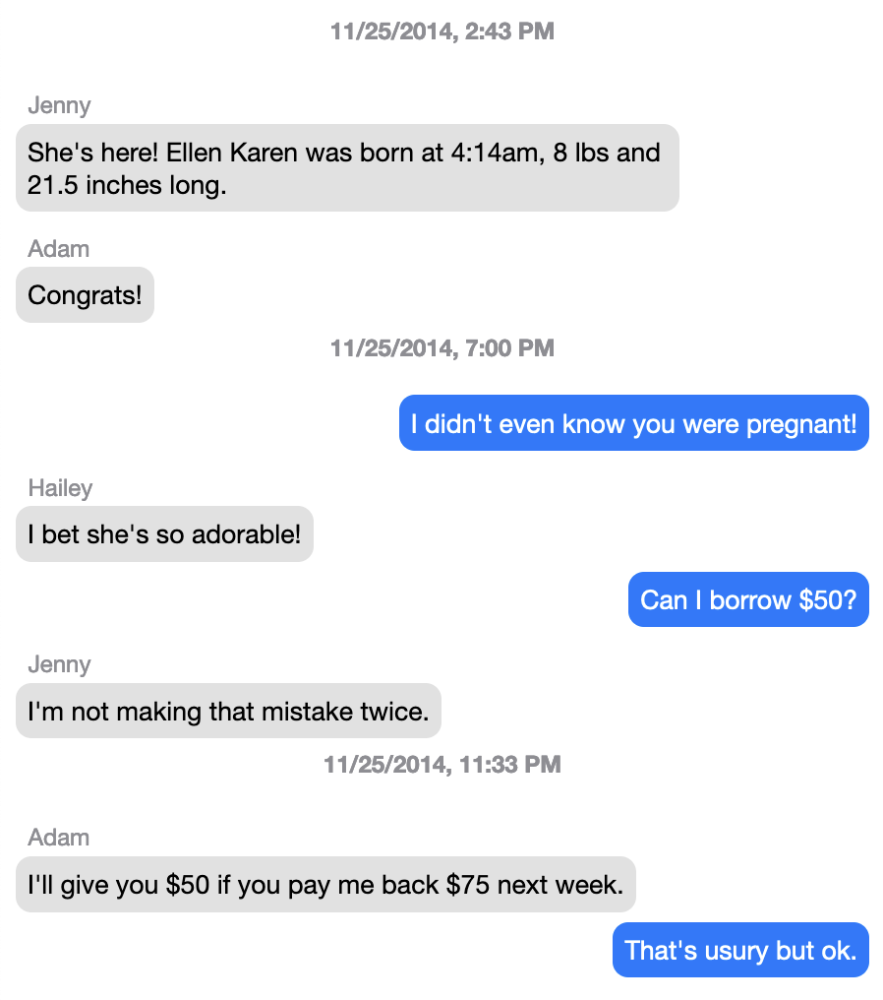

OSX Messages Exporter
=====================
Exports Messages' conversations to HTML files. This includes iMessages, SMSs, and group conversations. The simplest way to run it is this:

`php messages-exporter.php -o ~/Desktop/Messages/`

After it finishes, you'll have an HTML backup of the messages on your computer in a folder called "Messages" on your Desktop.

This script processes all of the existing conversations in the Messages app, logs them to a separate backup database in your specified output directory, and then generates HTML files for each conversation, mimicking the look and feel of Messages conversations:



See [example.html](example.html) to inspect the HTML generated by OSX Messages Exporter that produce the screenshot above.

Attachments are saved in a separate directory for each conversation.

It will try and match phone numbers and email addresses to real names, using your Mac's Address Book. It should be able to find contacts that are stored either on your Mac or in iCloud, if they've had time to sync to your Mac (typically only a few minutes).

Note that if you are running OSX Mojave or later, you will probably need to [give Terminal full disk access](https://osxdaily.com/2018/10/09/fix-operation-not-permitted-terminal-error-macos/) in order for OSX Messages Exporter to work.

With the `-f` or `--flush` option, you can force the script to delete the existing backup database and regenerate everything. (Without this option, you could maintain backups of conversations even if Messages deletes them, accidentally or not.) 

With the `-r` or `--rebuild` option, you can regenerate the HTML files from the backup library.

With the `-d` or `--database` option, you can run the export on a specific Messages database file. By default, the script uses `~/Library/Messages/chat.db`. Note that when using this option, attachments will not be saved, since the assumption is that the paths to the files are from another machine.

With the `--date-start` and `--date-stop` options, you can limit the dates that are added to your backup. Note that this only applies to new messages being exported; it won't remove messages outside of those dates that have already been exported.

With the `--path-template` option, you can define the format of the exported HTML filenames (as well as the date range for each individual file). The string `_CHAT_TITLE_` will be replaced by the chat title (usually just the name of the other participant), and any `strftime`-style placeholders will be replaced by the appropriate values for the chat's time period. For example, if you set `--path-template "%Y-%m-%d - _CHAT_TITLE_"`, then each exported HTML file will contain at most one day of messages, and they would have names like "2021-06-11 - Alex Smith.html".

Usage
=====
```
$ messages-exporter.php [-o|--output_directory output_directory]
                        output_directory: a path to the directory where the messages should be saved. Save files in the current directory by default.
                        [-f|--flush]
                        Optionally, flush the existing backup database, essentially starting over from scratch.
                        [-r|--rebuild]
                        Optionally, rebuild the HTML files from the existing database.
                        [-d|--database /path/to/chat/database]
                        Optionally, specify an alternate database file if, for example, you're running this script on a backup of chat.db from another machine.
                        [--date-start YYYY-MM-DD]
                        Optionally, specify the first date that should be queried from the Messages database.
                        [--date-stop YYYY-MM-DD]
                        Optionally, specify the last date that should be queried from the Messages database.
                        [-t|--timezone "America/Los_Angeles"]
                        Optionally, supply a timezone to use for any dates and times that are displayed. If none is supplied, times will be in UTC. For a list of valid timezones, see https://www.php.net/manual/en/timezones.php
                        [-p|--path-template "%Y-%m-%d - _CHAT_TITLE_"]
                        Optionally, supply a strftime-style format string to use for the exported chat files. **Use _CHAT_TITLE_ for the name of the chat.** For example, you can separate your chats into yearly files by using `--path-template "%Y - _CHAT_TITLE_"` or monthly files by using `--path-template "%Y-%m - _CHAT_TITLE_"`. You may also wish to use the date as a suffix so that chats from the same person are all organized together in Finder, in which case you might use `--path-template "_CHAT_TITLE_ - %Y-%m-%d"`
                        [--match "Conversation Title"]
                        Limit the output to conversations that include this argument somewhere in their title.
                        [--match_regex "/^Conversation Title$/"]
                        Limit the output to conversations whose titles match this regular expression.
```

Caveats
=======

* If you run the script, and then delete a conversation in Messages, and then run the script again, the backup of the deleted conversation will not be deleted. This is by design.
* If you try to run this script via a LaunchAgent or some other automated means, it may fail because the Messages database file is protected by Full Disk Access starting in Mac OS Mojave.  To get around this, you'll need to do the following:
    * Create a shell script that runs OSX Messages Exporter, like this:  
`#!/bin/bash`  
`php /path/to/OSX-Messages-Exporter/messages-exporter.php -o /path/to/output`
    * Package that script into an app using [Platypus](https://github.com/cfinke/OSX-Messages-Exporter)
    * Give the app [Full Disk Access](https://macpaw.com/how-to/full-disk-access-mojave)
    * Modify your LaunchAgent (or other automated script) to run the app instead of running OSX Messages Exporter directly.

Questions?
==========
Email me at cfinke@gmail.com.

Props
=====
Thanks to Garvin Hicking (@supergarv on Twitter) for fixes and improvements.
